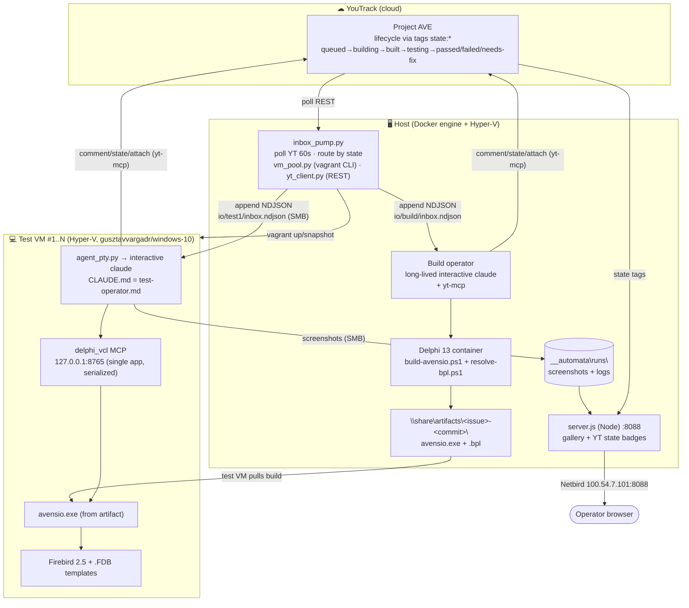
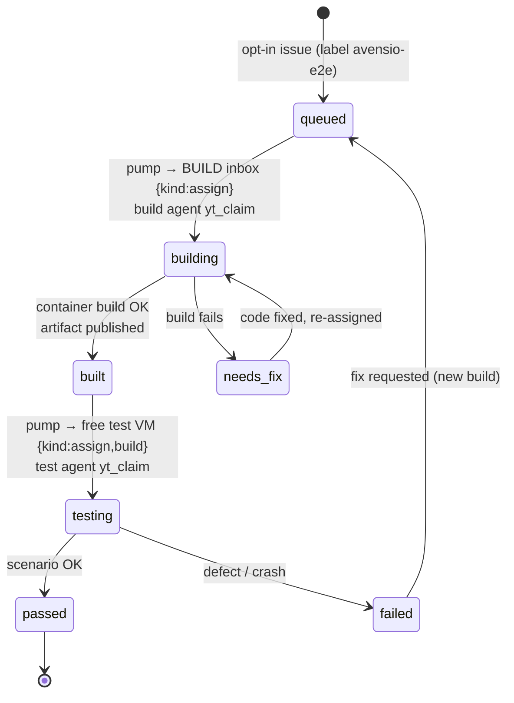
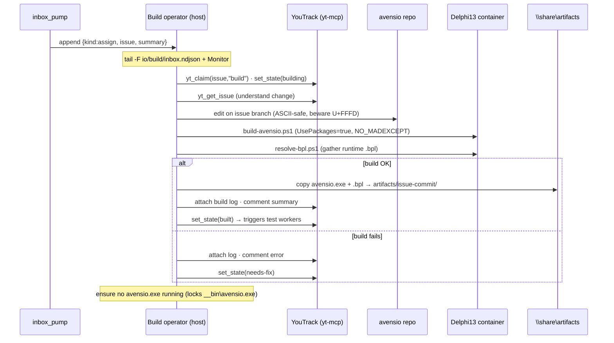
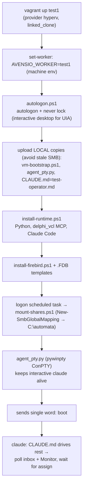
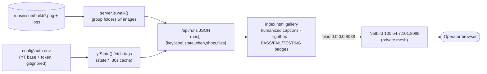

# avensio e2e — build & test process flow

End-to-end flow of the avensio.exe continuous build+test pipeline as actually
implemented under `__automata\`. **Edit+build** is a single serialized queue on
the host; **e2e GUI tests** run in parallel, one isolated Hyper-V VM per worker.
YouTrack is both the work queue and the message bus; everything is auditable
(build log + transcript + screenshots) per issue.

Transport rule (mirrors the jcw-worker pattern): **inbound = files** (per-worker
NDJSON inboxes on the SMB share), **outbound = MCP** (agents post comments /
state / attachments straight to YouTrack via `yt-mcp`). The orchestrator is an
inbound pump only — it never spawns `claude`.

---

## 1. Architecture (components + transport)



---

## 2. Issue lifecycle (state machine)

State lives as `state:*` tags on the YouTrack issue (see `yt_client.set_lifecycle`).
The pump routes purely off these tags + a small per-issue JSON in `state/`.



---

## 3. Build cycle (build operator, on `assign`)

One build at a time — shared working tree + heavy container build are never
parallelized.



---

## 4. Test cycle (test operator in VM, on `assign`)

```mermaid
sequenceDiagram
    participant P as inbox_pump
    participant T as Test operator (VM)
    participant YT as YouTrack (yt-mcp)
    participant DB as provision-test-db.ps1
    participant V as delphi_vcl MCP
    participant E as avensio.exe
    participant R as runs (SMB to host)

    P->>T: append kind=assign (issue, build) via SMB inbox
    Note over T: poll wc -l + sed, not tail -F (SMB appends invisible)
    T->>YT: yt_claim(issue,worker) then set_state(testing)
    T->>DB: copy clean .FDB + write avensio.ini
    T->>E: run-avensio.ps1 -Action start
    T->>V: delphi_connect_app avensio.exe
    loop while top window is TfrmNewTrialDialog
        T->>V: click Zavrit (dismiss DevExpress trial nag)
    end
    Note over T,E: TLoginForm, DB connects UNI_OMEGA/omega internally
    T->>V: type Uzivatel + Heslo (av-heslo), click OK
    Note over E: __bin/skripty must hold av_NNN.sql or fatal exit
    loop each scenario step (yt_get_issue)
        T->>V: drive GUI
        T->>R: delphi_screenshot to runs/issue/build/NN-step.png
    end
    T->>YT: attach screenshots + transcript, comment pass/fail
    T->>YT: set_state passed OR failed
    T->>E: run-avensio.ps1 -Action stop (force; WM_CLOSE wont kill at login)
    T->>DB: delete per-run .FDB
```

---

## 5. VM provisioning & agent boot



Key constraints baked in: GUI automation needs an **active interactive desktop**
(autologon, no screen lock); the SMB share is mounted machine-wide via
`New-SmbGlobalMapping` (the per-session vagrant SMB mount isn't visible to the
logon task's session); bootstrap files are uploaded to local `C:\avensio\`
because SMB can serve stale copies at boot.

---

## 6. Viewer / dashboard data flow



---

## Notes / non-goals
- **No `claude -p`** and no Agent SDK — only long-lived interactive `claude`
  sessions that poll their inbox and reply via `yt-mcp`.
- **Build is intentionally serialized** (one queue, one container build).
- Tests parallelize by **VM isolation only** — `delphi_vcl` is a single global
  app with `ThreadPoolExecutor(max_workers=1)` and drives the physical desktop,
  so 1 VM = 1 desktop = 1 worker.
- DB isolation = fresh `.FDB` copy per test; deep reset = `vagrant snapshot restore`.
- See memory: `avensio-e2e-pipeline`, `avensio-login-runtime`,
  `avensio-encoding-corruption`, `avensio-container-build`.
```
